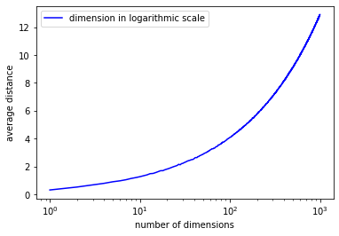
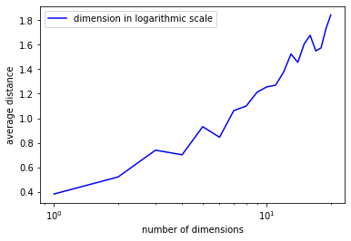
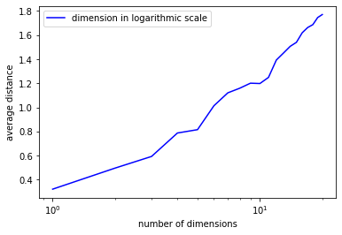
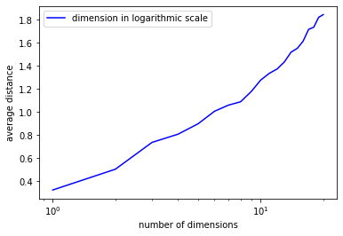

# Average_distance
A program that makes a graph with the number 
of dimensions on the horizontal axis using a logarithmic scale and the average distance between two points in an n-dimensional unit hypercube on the vertical axis. Your graph should be the result of generating a number of such pairs of points and averaging over the distances between them.

## Table of contents
* [Functions](#functions)
* [Technologies](#technologies)
* [Plot](#plot)
* [Result](#result)
* [TO DO](#to-do)

## Functions
#### dis(lst_coords)
The function takes a list of coordinates, and return a list of distances between any two points in the input.
The function uses combinations in itertools to readily combine any two points in a list.

####  ave(lst)
The function takes a list of distances, and return the average distance of the list.
####  generate(n, p)
The function generates a list of random points. P is the number of the points in the list, and n is the 
number of dimension. For example, if we set n = 3, p = 2. Any number in coordinates
should be between 0 to 1.
####  plot(n, p)
This is the main function to plot the graph. The function plots  a graph with the number 
of dimensions on the horizontal axis using a logarithmic scale and the average distance between 
two points in an n-dimensional unit hypercube. n is the max number of dimension we want to draw,
and p is the number of random points we want to generate in each dimension. 
	
## Technologies
Project is created with:
* Jupyter notebook: average_distance.ipynb
* Python: 3

	
## Plot
To plot the graph, run:

```
$ plot(n, p)
n, p are both positive integer
```
In the program, I run plot(1000, 100).
I set the random points generated for each dimension as 100.

## Result
The graph below is plot(1000, 100). The average distance increases 
very slowly at first, and then increases tremendously at around 100. 
 

## TO DO
The running time is pretty long when I set n = 10000, p = 1000. 
I will try bigger number when I get a better computer. It's pretty interesting to try some small
numbers like n = 20, p =10. I believe the graph will not be as smooth as the initial one.
Therefore, the next step we can do is to find a p where making the graph smooth. 
I did some progress on that:





These four graphs are all 20 dimensions, and with 10 random points,
30 points, 50 points, and 100 points. We could easily find that the more points we generate, the smoother the graph is.
